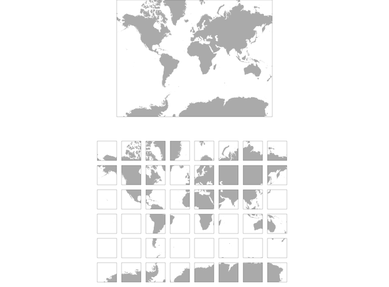
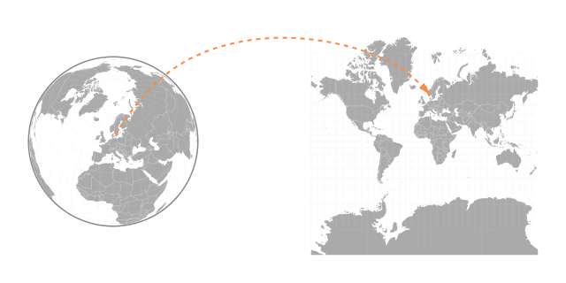
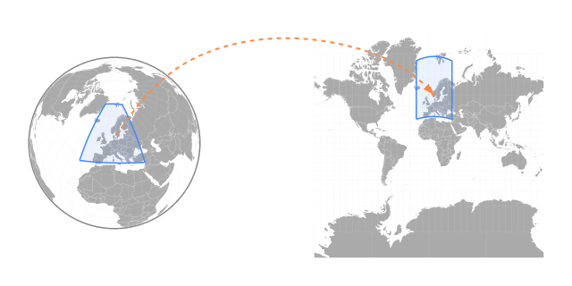

## About this document

This is a short, [free and open](https://github.com/perliedman/tiled-maps) introduction to the concept of tiled maps. It covers the basics as well as a lot of technical detail on how tiling maps work, for example projections and how coordinates are handled. It assumes basic knowledge about maps and geography. A good start before reading this document is for example [mapschool](http://macwright.org/mapschool/).

## Introduction

A common way to display maps on computers, especially on the internet, is to use so called _tiled_ maps. A tiled map means
that what appears to the user as one large map image, is really put together from a number of smaller images, _tiles_, that are drawn next to each other, without seams, to create the illusion of a much larger image.

[Google Maps](https://maps.google.com/) is most certainly the prime example of a tiled map. It made maps on the internet popular in 2005, by stitching together 256 by 256 pixel images of the whole world at remarkable detail. Today, almost all maps on the internet aimed to the public use tiling.

## Why tiled maps?

Lets go through how one could go about creating a map to be published on the internet.

As a first attempt, we scan a paper map and publish the resulting bitmap image on the internet. This digital equivalent of a paper map has the same limitations as a paper map: the amount of detail is limited by the size of the image; adding more detail without cluttering the map forces us to either increase the size of the image, or reduce the scale of the map. This is fine if the purpose of the map is known before hand: the scale and size can be optimized for one purpose. For a general purpose map, this can't be done easily.

An alternative is to produce several maps at different scales, from large scale overview maps, down to highly detailed maps.

### Zoom levels

The concept described above, storing multiple images of the geographic area covered, but with different scales, is commonly called _zoom levels_, since the increasing scale can be envisioned as "zooming" into the map, making features larger and larger while also revealing more detail.

### Image size

A problem with this approach is that while increasing the scale, the image size quickly grows to sizes that become unwieldy to handle with current technology, if all zoom levels should cover the same geographic area.

As an example, Google Maps cover the whole world in one single 256×256 pixel image at its outermost zoom level. At the 20th zoom level, the size has grown to 134 million by 134 million pixels, an image that even assuming some pretty good compression would be about 25 terrabytes in size. Needless to say, no consumer grade computer can handle such an image, not to mention the time and bandwidth required to download it from the internet.

### Tiling

Instead of making a single, huge image, a tiling map will divide the image into several smaller images, _tiles_, of a fixed size. When displaying the map, only the images covering the geographic area currently being displayed are required. This means that typically only 20-30 tiles are needed to display any geographic area, independent of zoom level. This technique makes it possible to display maps at even modest hardware.

### Tiles are not just images

Tiling is not necessarily just for images. The same technique can be used for other types of geographic data, where the data set is a coverage for a geographic area, and grows to unmanageable size. For example:

* [Vector tiles](https://github.com/mapbox/tm2)
* [UTFGrid](https://github.com/mapbox/utfgrid-spec)

## Alternatives to tiling

Tiles are not the only method to achieve global maps at multiple scales. Another common method is to let the viewing application (web browser, for example) request an image of the current geographic location, and then let a server draw the bitmap image. One such technology is called WMS (Web Map Service), and standardizes how such images can be obtained. This method also removes the concept of fixed zoom levels, and produces images at whatever scale is requested.

While more general than a tiled map, this method puts larger strain on the application that services the requests. Since the geographic areas and scales being requested can't be known in advance, each image have to be drawn from scratch, which can be a very complicated process for detailed maps or when advanced cartographic techniques are used. This makes WMS and similar technologies infeasible to use if the service is being used by a large number of users.

In contrast, with a tiled map, there is a limited, although possibly very high, number of possible tiles. This means they can all be drawn in advance, or cached once requested, with that all or requests can be served without any processing, making it highly efficient even for a large number of users.

## Making tiled maps

A number of concepts are involved in transforming geographic data into a tiled map. Several of the steps are common to any digital cartography, but a few steps must be added to achieve the actual tiling.

### Projections

Geographic locations can be stored in a great number of ways, but the most common and universal is to use latitudes and longitudes. Another name for this method is _WGS84_, and while technically not exactly the same thing, they can often be thought of as equivalent.

Together, a latitude and longitude designates an exact location on the surface of the earth, or the earth's spheroid. Since the spheroid is (more or less) round, it can't be used directly to draw a map on a flat surface like a paper or a computer screen. To do this, we need a method that describes how a latitude and longitude corresponds to a point on the flat surface. In other words, this tells us how a latitude and longitude is _projected_ onto the surface, and the method is hence called a _projection_.

One way of putting it is to say that the projection takes a latitude/longitude pair from the round earth's coordinate space, and projects (or converts, or transforms - exact terminology varies) it into the projection's coordinate space; the result can be referred to as _projected coordinates_.

Some projections have global coverage, meaning that any latitude/longitude can be transformed into projected coordinates. Other have only local coverage, which means that some latitudes and longitudes cannot be projected in a sensible way. The latitudes and longitudes within which the projection is valid, are referred to as the projection's _bounds_, which can be expressed in latitudes and longitudes, but also the projection's _projected bounds_, which are expressed in projected coordinates.

_Words about bounding boxes, lines etc. and how they're projected/unprojected_

### From projection to map image

There's no standard for what a projected coordinate means. It's common to denote the coordinate components as _x_ and _y_, the same as the convention in most coordinate system. Often the y axis is directed in north/south direction, or at least close to, and the x axis in east/west direction. It is also common for the coordinate unit to be some common distance unit like meters or feet.

On the other hand, there are many cases where the x and y axis are swapped, such that x is north/south oriented. The units might be degrees, radians or something without any trivial correlation to real world distance units. In short, the projected coordinates themselves are often not directly suitable to draw a bitmap image from, since the projected coordinates rarely correspond to the desired pixel coordinates in an image.

To use the projected coordinates for bitmaps, another mathematical operation has to be applied to them. In comparison to the projection, this operation is however usually much simpler. It involves:

* Scaling the projected coordinate to achieve the desired scale or size of the image
* Translation to move the relevant parts of the projection space to a desired place, usually close to the coordinate system's origin
* Rotation, shear and/or mirroring to make x and y axis point in the desired direction

Although these operations can be implemented in several ways, it is helpful to know that they are so called _affine transformations_ that can be implemented by matrix multiplication, a fact that many tiled map libraries take advantage of.

After applying this transformation, the projected coordinate has been transformed to a _pixel coordinate_, referring to a specific pixel in a bitmap image.

### Making tiles

As already described, a tiled map consists of a number of zoom levels, where each zoom level is a map of the same geographic area, but drawn at different scales, split into tiles, where each tile has the same size independent of the zoom level. Increasing scale also means increasing the map's size in pixels, which in turn increases the number of tiles in that zoom level.

Tiles are organized into _rows_ (up/down direction) and _columns_ (left/right direction). Calculating the row and column number from a pixel coordinate, is a simple as subtracting the tile set's origin from the pixel coordinate, and dividing the result by the tile size in pixels, usually rounding the result to an integer.

### Addressing tiles

To complicate matters, there are at least three different conventions for how to refer to a single tile.

#### TMS

[TMS](http://wiki.osgeo.org/wiki/Tile_Map_Service_Specification) (Tile Map Service) addresses a tile by numbering the zoom levels, starting from 0. The tile rows and columns are also numbered, starting with 0 on the bottom left and growing to the right and upwards.

TMS numbers zoom levels by two different schemes depending on the map projection used:

* For projections with global coverage (global-geodetic and global-mercator), zoom level 0 is the most zoomed out (lowest scale), and increasing zoom levels also increase scale
* For local projections, zoom level 0 is the zoom level with the highest scale, fixed at 1 projected coordinate per pixel, ncreasing zoom levels decrease the scale

#### Google Maps / OpenStreetMap / Slippy map tile naming

This is a de facto standard used by several tile providers, most notably Google Maps and [OpenStreetMap](http://wiki.openstreetmap.org/wiki/Slippy_map_tilenames).

The standard is only well documented for one projection: spherical Mercator. Addressing is very similar to TMS. Zoom level 0 is the most zoomed out (lowest scale), at this level the whole world fits into one tile, increasing zoom one level doubles the scale. Rows and columns are numbered from 0, starting from top left, and growing to the right and _downwards_. Note that this means that compared to TMS, rows are numbered in the opposite direction.

This scheme can be adapted to be used with other projections than spherical mercator, but there is no well established standard for doing so.

#### Tiled WMS

There are a number of standards and proposals for tiling WMS. Their relation to each other is confusing.

* [WMTS](http://www.opengeospatial.org/standards/wmts), which might be the same as [WMS-C](http://wiki.osgeo.org/wiki/WMS-C) or the [WMS Tile Caching](http://wiki.osgeo.org/wiki/WMS_Tile_Caching) standard
* [WMS Tiling Recommendation](http://wiki.osgeo.org/wiki/WMS_Tiling_Client_Recommendation)

They all have in common that rather than addressing a tile by explicitly numbering the rows, columns and zoom levels of the tile set, they use the WMS standard's request to gather this information implicitly.

A WMS request, among many things, includes a bounding box, specifying the projected coordinates of the requested image. From this bounding box, the scale can be calculated which gives the zoom level. By transforming the projected coordinates to pixel coordinates for this zoom level, the tile's row and column can be calculated.

## Credits

Inspiration from [Tom MacWright](http://macwright.org) and his project [mapschool](http://macwright.org/mapschool/).

Background pattern is Zwartevilt by [E. van Zummeren](http://www.evanzummeren.com/), published on [Subtle Patterns](http://subtlepatterns.com/).

## License

[ Creative Commons Attribution 3.0 Unported](http://creativecommons.org/licenses/by/3.0/deed.en_US)